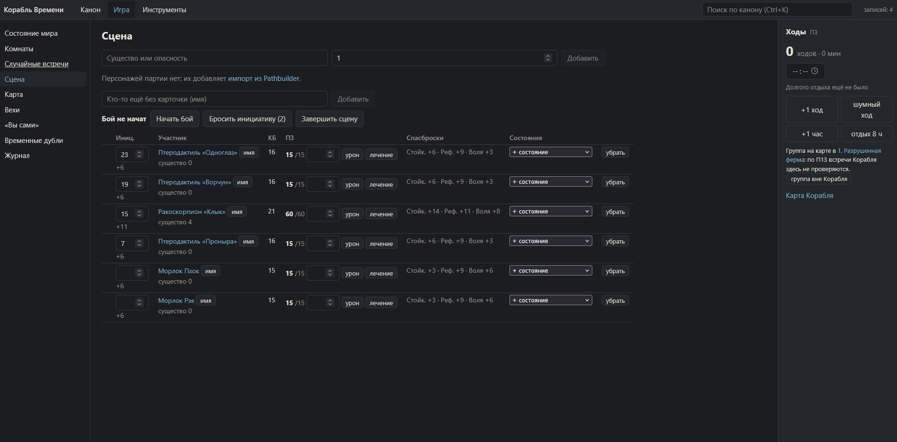
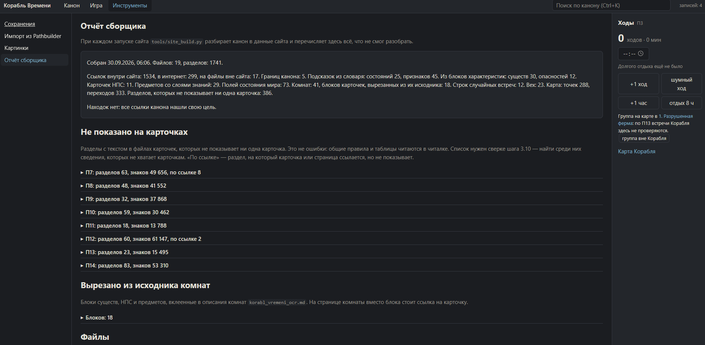

# Сайт Мастера «Корабля Времени»

*English version below.*

Веб-приложение для мастера настольной ролевой игры: подготовка к сессии и ведение игры в реальном времени. Сделано для моей конверсии OSR-приключения «Корабль Времени» под Pathfinder 2e.

## Что это

Приключение описано в markdown-документах (канон). Сайт читает их и превращает в рабочий инструмент мастера:

- карточки существ, НПС, опасностей, предметов и комнат со ссылками между ними;
- интерактивная карта Корабля: проходы, секретные двери, фишки персонажей, режимы правки;
- сцена боя и трекер ходов, случайные встречи, вехи прогресса;
- импорт персонажей игроков из Pathbuilder 2e (JSON);
- поиск по всему канону и подсказки к терминам правил;
- журнал всех действий с отменой.

## Скриншоты

Сцена боя: инициатива, урон и лечение, спасброски, состояния; справа — трекер ходов.



Отчёт сборщика: что разобрано из канона и что не показывает ни одна карточка.



## Устройство

```text
канон (*.md) ──site_build.py──▶ canon.json
                                    │
браузер ◀── site_server.py ◀────────┘
   │  события ▲  SSE
   ▼          │
saves/*.jsonl (журнал событий)
```

- **Фронтенд** — JavaScript (ES-модули), Preact + htm одним файлом, без npm и без сборки. Адаптивная вёрстка до 375 px.
- **Сборщик** (`tools/site_build.py`) разбирает markdown в JSON при каждом старте и пишет отчёт о том, что не смог разобрать. Сборка детерминирована: две подряд совпадают байт в байт.
- **Сервер** (`tools/site_server.py`) — только стандартная библиотека Python. Раздаёт сайт, принимает события и рассылает их всем открытым окнам через Server-Sent Events.
- **Состояние — журнал событий.** Каждое действие — событие, состояние — все события по порядку. Отмена — тоже событие, из журнала ничего не стирается.

Подробное техническое описание: [site/README.md](site/README.md).

## Как делалось

Около 8 000 строк JavaScript и 4 000 строк Python за полторы недели, больше сотни коммитов по сайту. Код писался с AI-агентами (Claude Code, Cursor) по плану из небольших шагов:

1. план шага — цель, решения, файлы, проверки;
2. бриф агенту, реализация;
3. отчёт агента: дифф, дословный вывод проверок, что проверено в браузере;
4. моя проверка и правки, коммит.

Правила для агента лежат в [.cursor/rules/korabl-vremeni.mdc](.cursor/rules/korabl-vremeni.mdc).

## Почему здесь нет данных

Канон построен на коммерческом бумажном модуле, поэтому он хранится в приватном репозитории. Здесь только код сайта, сервера и сборщика. Без канона сайт запустится, но покажет, что данных нет.

Запуск: `start.bat` (нужен Python 3), адрес `http://127.0.0.1:8741/`.

---

# Time Ship GM Site

A web app for a tabletop RPG game master: session prep and running the game live. Built for my Pathfinder 2e conversion of the OSR adventure "Time Ship".

## What it is

The adventure is written as markdown documents (the canon). The site reads them and turns them into a GM tool:

- cards for creatures, NPCs, hazards, items and rooms, cross-linked;
- an interactive map of the Ship: passages, secret doors, character tokens, edit modes;
- a combat scene and turn tracker, random encounters, progress milestones;
- player character import from Pathbuilder 2e (JSON);
- search across the whole canon and rule term tooltips;
- a journal of every action, with undo.

## Screenshots

Combat scene: initiative, damage and healing, saves, conditions; the turn tracker on the right.


Builder report: what was parsed from the canon and what no card shows.


## Design

- **Frontend** — JavaScript (ES modules), Preact + htm in a single file, no npm, no build step. Responsive down to 375 px.
- **Builder** (`tools/site_build.py`) parses the markdown into JSON on every start and reports whatever it could not parse. The build is deterministic: two runs in a row match byte for byte.
- **Server** (`tools/site_server.py`) — Python standard library only. Serves the site, accepts events and broadcasts them to every open window via Server-Sent Events.
- **State is an event log.** Every action is an event; the state is all events applied in order. Undo is an event too; nothing is erased from the log.

Detailed technical description: [site/README.md](site/README.md).

## How it was made

About 8,000 lines of JavaScript and 4,000 lines of Python in a week and a half, over a hundred commits on the site. The code was written with AI agents (Claude Code, Cursor) following a plan of small steps:

1. step plan — goal, decisions, files, checks;
2. a brief to the agent, implementation;
3. the agent's report: diff, verbatim check output, what was verified in the browser;
4. my review and fixes, commit.

The agent rules are in [.cursor/rules/korabl-vremeni.mdc](.cursor/rules/korabl-vremeni.mdc).

## Why there is no data here

The canon is based on a commercial paper module, so it lives in a private repository. This repository holds only the site, server and builder code. Without the canon the site starts but shows that there is no data.

Run: `start.bat` (needs Python 3), then open `http://127.0.0.1:8741/`.
